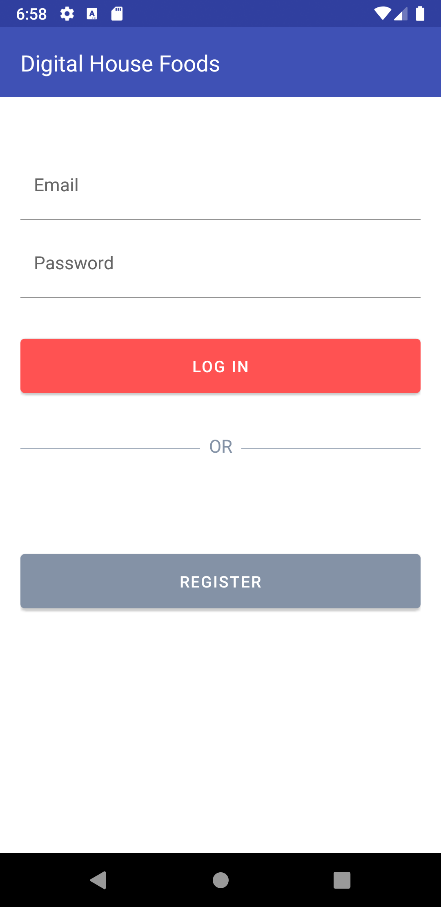
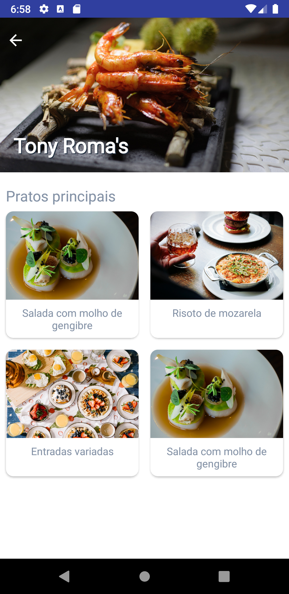
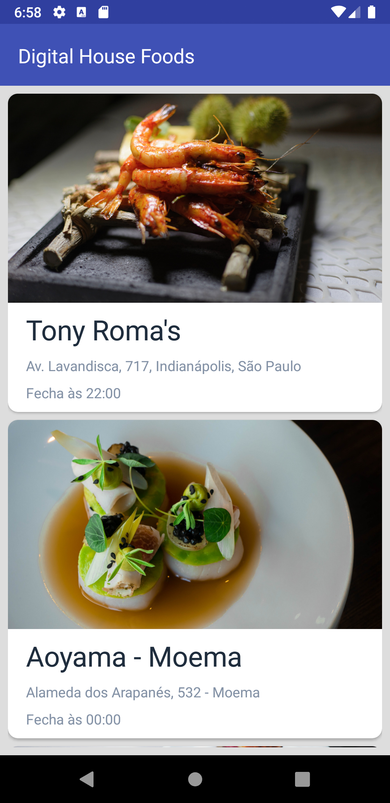

# Digital House - Foods app

         

Este projeto foi desenvolvido como desafio 2 do curso de Dev Android da Digital House. Seu objetivo é simular um app que apresente a lista de resutaurantes e sua lista de pratos principais. 